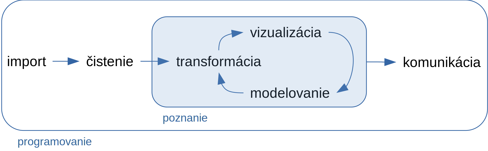
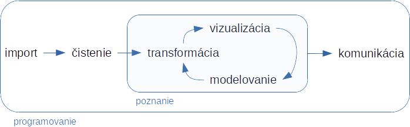

```{r, include=FALSE}
knitr::opts_chunk$set(
  collapse = TRUE
)
```

# R ako nástroj Data science

*Data science* je terminus technicus označujúci interdisciplinárny odbor, ktorý je zameraný na jediný cieľ: pochopiť skutočné javy na základe pozorovaných údajov. Zjednocuje štatistiku, hĺbkovú analýzu údajov (data mining, DM), strojové učenie (machine learning, ML) a súvisiace metódy.

 Základný postup pri práci (work flow) s dátami zahŕňa import a čistenie dát, potom fázu objavovania informácií pomocou vhodnej transformácie údajov, ich zobrazenia a tvorby zjednodušených modelov,  a nakoniec prezentácie cieľovej skupine ľudí (pozri Obr. \@ref(fig:workflow), podľa @wickham2016r v kapitole Introduction):
 
 - *import* (zo súboru, databázy alebo web API) do tabuľky typu data frame
 - *čistenie*, teda napr. úprava do tzv. long formátu (každá premenná má svoj stĺpec, každý riadok predstavuje pozorovanie)
 - *transformácia*, napr. zúženie výberu na dáta, ktoré nás zaujímajú; vytvorenie nových premenných (z existujúcich); výpočet súhrnov
 - *vizualizácia* (exploratory - objavná, neskôr explanatory - vysvetľujúca) je základná ľudská aktivita, dobrá vizualizácia ukáže súvislosti, ktoré sme vôbec nečakali, prípadne podnieti ďalšie otázky.
 - *modelovanie* ako doplnok ku vizualizácii odpovedá na otázky o dátach (na rozdiel od viz. nemôže prekvapiť), napr. či je nejaká ich vlastnosť významná, alebo aké javy/hodnoty sú za určitých podmienok očakávateľné.
 - *komunikácia*, zdielanie poznatkov vhodnou formou
 
 Všetko je to pretkané *programovaním*, bez znalosti ktorého by sme boli obmedzení dostupnosťou nástrojov -- neschopní napr. automatizácie často opakovaných úkonov či riešenia špecifických úloh, a to najmä vo fáze prípravy dát (tzv. *data wrangling* tvorí v praxi priemerne 80% práce DS/ML inžiniera, resp. analytického tímu).

```{r workflow, echo=F, fig.cap='Pracovný postup', out.width='80%', fig.align='center'}
if(knitr::is_html_output()) {
  
} else {
  
}
```

Nasledujúce kapitoly sa venujú všetkým aspektom data science, sú však zoradené s ohľadom na štruktúru predmetu *Štatistický softvér R* v 1.ročníku študijného programu Matematicko-počítačové modelovanie na Stavebnej fakulte STU v Bratislave, tak aby udržali pozornosť a záujem študentov. Preto sa striedajú témy tvorby vizuálneho obsahu (ktoré sú viac obľúbené) s témami technickejšieho charakteru, priestor dostávajú najprv nástroje základného jazyka R až potom nástroje ekosystému *tidyverse* [@wickham2019welcome], a na koniec sú zaradené pokročilejšie témy - také, ktoré rozvíjajú programovacie zručnosti.
